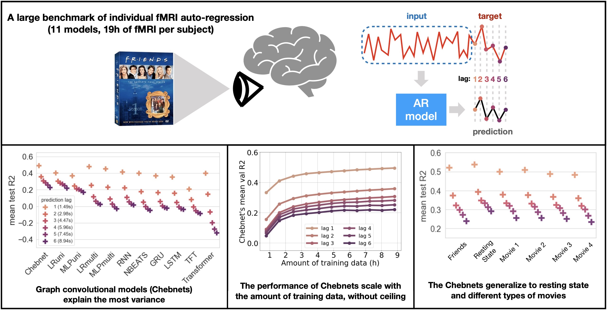

# fmri-autoreg

This repo contains the code for the paper "A benchmark of individual auto-regressive models in a massive fMRI dataset".

Several deep learning architectures are trained to predict the evolution of BOLD time series.
The code allows to perform gridsearch on each one of the architecture, to compare them and find the model architecture that is the most appropriate for BOLD time series auto-regression.

## Installation

Install torch 1.12.1:

`pip install torch==1.12.1`

Install torch geometric dependancies:

`pip install pyg-lib torch-scatter torch-sparse torch-cluster torch-spline-conv torch-geometric -f https://data.pyg.org/whl/torch-1.12.0+cpu.html`

> **Note:** this installs the cpu version of torch_geometric, to use cuda acceleration see the [torch geometric documentation](https://pytorch-geometric.readthedocs.io/en/latest/install/installation.html) for the command that corresponds to your cuda version.

Install the rest of the dependancies:

`pip install -r requirements.txt`

Install this repo as a local module:

`pip install -e .`

## How to use

TODO

## Paper results

TODO
